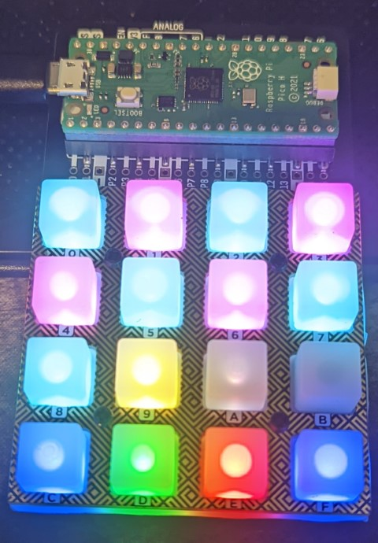
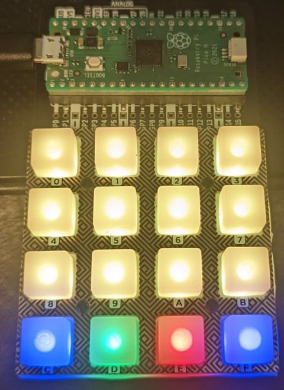
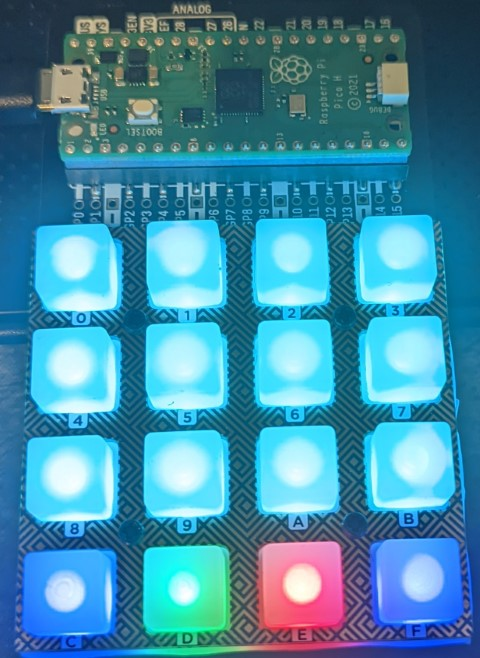

# PicoKeypadSoundboard

## Ian Sodersjerna

## Description:

A simple soundboard for the PicoKeypad and PlopBot.





## Installation:

1. Install [Python 3.6](https://www.python.org/downloads/) or later.
2. Install the [Thonny](https://thonny.org/) IDE, we will use this to program the pico.
3. Install Custom [MicroPython](https://github.com/pimoroni/pimoroni-pico/releases/latest/) to pico. A tutorial can be
   found [here](https://learn.pimoroni.com/article/getting-started-with-pico).
4. Download the latest release of
   the [PicoKeypadSoundboard](https://github.com/plop91/PicoKeypadSoundboard/releases/latest)
5. Open `pico/main.py` in Thonny and save the program to the Pico.
6. Go to the `desktop` folder then go to the folder for your OS.
7. run the install script for your OS.
8. make a link startup script for your OS on the desktop. (in windows this can be done by right-clicking on the startup
   script and selecting `send to -> Desktop`)
9. To begin using the Bot follow the Usage instructions provided below.

## Usage:

### Config file:
In `desktop/` either create a file called `config.json` or rename `config.json.sample` to `config.json` and edit with a text editor such as [Notepad++](https://notepad-plus-plus.org/downloads/).

config.json  
```json
{
"username": "ExampleUser", # The username of the user you want to use the bot as. (same as registered on the website)
"avatar_url": "", # The avatar url of your user.(most people leave this blank)
"address": "", # The address of the bot. (provided  by server owner)
"com": "COM9", # The com port of the pico. (this can be found in Thonny)
"baudrate": 9600, # The baudrate of the pico. (this should remain 9600)
"timeout": 1, # The timeout of the pico.(this should remain 1)
"parity": "PARITY_NONE", # The parity of the pico. (this should remain PARITY_NONE)
"rtscts": 0, # The rtscts of the pico. (this should remain 0)
"pages": { # Pages include the name of the page and the sound files and colors for each page
"home": [ # each page starts with a name a colon and the opening bracket, followed by 16 sound files and 16 colors.
["random", "cyan"], # each sound file color pair sould be surrounded by brackets
["2stars", "magenta"], # the name of the sound files and colors should be in quotations.
["2chainz", "cyan"], # there should be a comma between the sound file name and the color
["5stars", "cyan"], # adding '%' befor the color acts as a color macro
["1star", "%random"], # you can have random flashing colors
["2stars", "%rainbow"], # or move through the rainbow.
["2chainz", "magenta"], # adding '%' before a sound file makes it into a command. 
["5stars", "cyan"], # commands can change how the keypad respoinds
["peepeepoopooman", "cyan"], # the avaliable commands are as follows
["%reset", "yellow"], # reset the colors to their default settings
["%rainbowon", "white"], # set  all the keys to rainbow mode
["%rainbowoff", "off"], # turn off rainbow mode
["%page1", "blue"], # including the name of another page can send you to that page 
["%home", "green"], # you can have unlimited pages so go wild.
["%stop", "red"], # if things  get too wild you can stop the bot from playing sounds.
["%page2", "blue"] # remember on the last item there is no comma!!
], # closing bracket for the home page followed by a comma if we have another page.
"page1": [ # adding a second page is as easy as the first!
["%pause", "cyan"], # you can pause the bot to confuse your friends.
["%resume", "cyan"], # and resume to confuse them more. 
["snake", "cyan"],
["kanye", "cyan"],
["1star", "cyan"],
["2stars", "cyan"],
["2chainz", "cyan"],
["5stars", "cyan"],
["1star", "cyan"],
["2stars", "cyan"],
["2chainz", "cyan"],
["5stars", "cyan"],
["%page1", "blue"],
["%home", "green"],
["%stop", "red"],
["%page2", "blue"]
],
"page2": [
["peepeepoopooman", "yellow"],
["voodoo", "yellow"],
["snake", "yellow"],
["kanye", "yellow"],
["1star", "yellow"],
["2stars", "yellow"],
["2chainz", "yellow"],
["5stars", "yellow"],
["1star", "yellow"],
["2stars", "yellow"],
["2chainz", "yellow"],
["5stars", "yellow"],
["%page1", "blue"],
["%home", "green"],
["%stop", "red"],
["%page2", "blue"]
]
}
}

```